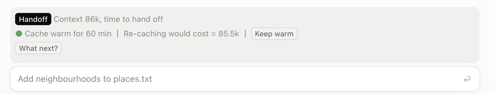
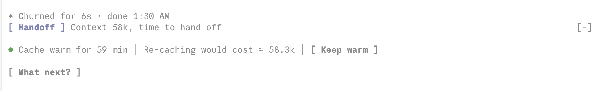

# chalkery

[](https://github.com/drdickgraysonjr/chalkery/actions/workflows/ci.yml)

English | [Українська](README.uk.md)

A chalkery is where the chalk lives: a home for Claude Code mods that draw above the prompt.

Three Claude Code mods that draw a band above the prompt, in the terminal and in the desktop app's Code tab.





*The screenshots were taken with the `threshold` option lowered, so Handoff lights up below 180k.*

| Mod | What it does |
| --- | --- |
| [`handoff-relay`](plugins/handoff-relay) | A Handoff button that runs `/handoff`. It lights up from 180k tokens of context (the `threshold` option). Once the handoff document is written, the button gives way to "Handoff created". The mod brings its own `handoff` skill, so the button works out of the box. |
| [`cache-meter`](plugins/cache-meter) | Shows how long the prompt cache stays warm and what a re-cache would cost. Keep warm stops it from going cold. Before you send into a big cold cache, it asks first. |
| [`next-steps`](plugins/next-steps) | A What next? button that suggests up to three next prompts. The one you pick becomes a draft in the input box; you press Enter. |

Install them one by one or all at once. In any combination they form one band, always in the same order: Handoff, cache, What next?

## Requirements

Claude Code 2.1.289 or newer. The mods are built on function hooks, a recent part of Claude Code, and are tested on 2.1.289. Older versions may refuse to load them: 2.1.96, for example, rejects their manifests.

Check your version with `claude --version` and update with `claude update`. The desktop app updates itself.

## Install

Add the marketplace first:

```bash
claude plugin marketplace add drdickgraysonjr/chalkery
```

All three mods in one command. The pack is called primaries: three mods, like three primary colours.

```bash
claude plugin install primaries@chalkery
```

Or just the one you need:

```bash
claude plugin install cache-meter@chalkery
```

In the desktop app the same is under Plugins → Add plugin: the Marketplaces tab, then Add marketplace. The mods start working from the next session.

When a new version is out, refresh the catalog, then each installed mod:

```bash
claude plugin marketplace update chalkery
```

```bash
claude plugin update cache-meter@chalkery
```

To remove the pack: `claude plugin uninstall primaries@chalkery`. The three mods it installed stay; `claude plugin prune` removes them too.

## Language

The mods speak English and Ukrainian. Each has a `language` option: `auto` (the default), `en` or `uk`. With `auto`, the mods follow Claude's response language from `/config`, so one setting covers all three; a language the mods do not have, or none, gives English. To set it explicitly, change the option in `/config`, or pass it at install time:

```bash
claude plugin install cache-meter@chalkery --config language=uk
```

## The handoff skill

`handoff-relay` ships a `handoff` skill. It writes a handoff document for the next session into `.claude/handoffs/` under the project root; if the project's CLAUDE.md names another folder, it uses that. Handoffs form chains: the session that picks one up is titled `<name> H<N>`, and each phase gets its own file. In the desktop app the skill also creates a card that starts the next session; in the terminal it prints the start prompt to paste. If you already have your own `/handoff`, the button runs yours.

## next-steps options

After install the CLI says that some options are not set. All of them have defaults, so setting them is optional.

| Option | Default | What it does |
| --- | --- | --- |
| `language` | `auto` | `auto`, `en` or `uk`, as above |
| `minAnswerChars` | `80` | No button after shorter answers |
| `suggestSkills` | `true` | A suggestion may be one of the session's skills or slash commands |

## Troubleshooting

**`Unrecognized key: "options"` or `invalid manifest file`.** Your Claude Code is older than the mods need. Run `claude update`, then install again.

**`primaries` says `Dependency "handoff-relay@chalkery" is not found in any configured marketplace`.** The marketplace is most likely fine: one of the mods failed to install, and the pack reports it this way. Install that mod on its own to see the real error:

```bash
claude plugin install handoff-relay@chalkery
```

Most often it is the old-version error above.

## For authors

```
.claude-plugin/marketplace.json   the catalog: the pack and three mods
plugins/<mod>/                    each mod stands alone and installs on its own
plugins/<mod>/hooks/locales/      en.mjs and uk.mjs: every word the mod shows a person
plugins/handoff-relay/skills/     the handoff skill and its phase script (python3, with tests)
plugins/primaries/              the pack: only dependencies on the three mods
shared/band.mjs                   the shared band contract
shared/i18n.mjs                   picking the language for the language option
scripts/sync-shared.sh            copies shared/*.mjs into each mod's hooks/
scripts/check.sh                  runs every check CI runs
docs/                             the screenshots in the READMEs
.github/workflows/ci.yml          CI: on every push and pull request, and weekly
```

**The shared band.** The order in which the engine chains different plugins' `ui.render` hooks is not documented and depends on how they were installed. So a mod does not put its row above or below what `next(e)` returned. It places its row into the shared `prompt-band` column at its own spot: Handoff 10, cache 20, What next? 30. Anything foreign, such as the engine's own row or a mod from elsewhere, goes below them. A mod may be installed without its neighbours, so `band.mjs` and `i18n.mjs` are copied into each one. Edit `shared/`, then run `scripts/sync-shared.sh`; `scripts/sync-shared.sh --check` confirms the copies match.

**Languages.** A mod's code holds no text a person sees: it reads it from `locales/<language>.mjs`. A new language is one more file in each mod, a line in `LOCALES` and a pattern in `shared/i18n.mjs`. Each mod's tests check that every locale has the same keys.

**Checks.** `scripts/check.sh` runs them all: it validates the manifests, runs each mod's tests and the phase script's tests, compares the shared copies, checks versions against release tags and installs `primaries` into a throwaway home folder. CI runs the same on every push and pull request with Claude Code 2.1.289, the oldest version this README promises, and every Monday with the newest one; GitHub emails you when the weekly run fails. To check a single mod:

```bash
claude plugin validate plugins/cache-meter && claude plugin test plugins/cache-meter
```

The band tests load the neighbouring mods as separate plugins in both orders. The language tests cover `en`, `auto` without `/config` and `auto` with Ukrainian in `/config`.

**Live development.** To work on your checkout rather than the installed version, add the mod folders to `CLAUDE_CODE_PLUGIN_DIRS` (colon-separated). A plugin loaded from there shadows an installed one of the same name.

**Release.** Raise `version` in `plugins/<mod>/.claude-plugin/plugin.json`. Without it, `claude plugin update` will not see the change, and CI fails when a mod changed since its last release tag but kept its version. After the merge, tag the release from the mod's folder: `claude plugin tag --push` creates `<mod>--v<version>`, the tag that plugin dependencies resolve against.

**Release checklist.** CI does not see the band itself, so check by hand before tagging:

1. `scripts/check.sh` passes.
2. With the changed mods in `CLAUDE_CODE_PLUGIN_DIRS`, a new terminal session shows the band in order: Handoff, cache, What next?
3. The same in the desktop app's Code tab.
4. Handoff runs `/handoff` and, once the document is written, gives way to "Handoff created" in the terminal too; What next? offers suggestions, and `/cache` shows the cache status.
5. With `language` set to `uk` and then `en`, every label changes language.
6. Each changed mod has a new `version`.

## Licenses

`handoff-relay`, `primaries` and the shared code: MIT, Yehor Hunia. `cache-meter` is a fork of the cache part of cache-keeper from [nateherkai/claude-code-mods](https://github.com/nateherkai/claude-code-mods), MIT, Nate Herk. `next-steps` is a fork of [anthropics/claude-plugins-community/next-steps](https://github.com/anthropics/claude-plugins-community/tree/main/next-steps), Apache 2.0. Each mod's license is in its folder.
